# 分布式大规模数据函数依赖发现算法技术报告

SA21010042 虞佳焕

此实验由虞佳焕一人完成，参考了*参考文献 1*。

## 1. 并行化设计思路和方法

### 1.1 问题分析

分布式 FD 发现面临两个基本问题：**正确性**和**计算复杂度**。

#### 1.1.1 正确性

在分布式场景下，数据往往被分片存储在不同的节点上，即每个节点只存储所有元组的一个子集。显然在子集中成立的 FD 并不一定在整个数据集上成立。

之所以出现单个节点上成立的函数依赖 $fd$ 在全局不成立，是由于该 $fd$ 左部取值相同的数据出现在了多个节点，进而无法发现它们右部存在的冲突。

为了保证分布式场景下算法的正确性，**只需要保证该 $fd$ 左部相同的数据在同一个节点上即可**。

因此，对于给定关系 $R(A_1, A_2, \cdots, A_n)$, 在分布式场景下保证 FD 发现正确性的基本思路如下：

1. 依次选取属性 $A_i \in (A_i, A_2, \cdots, A_n)$，执行步骤 2 和 3，直到所有的属性被处理完毕；
2. 对数据进行重分布，保证在 $A_i$ 上取值相同的数据被发送到同一个节点；
3. 在每个节点利用部分数据并行地发现所有左部包含冯 $A_i$ 且不包含 $A_1$ 到 $A_{i-1}$ 的非平凡 FD；
4. 当所有属性被处理后，去除结果中所有的非最小 FD 得到所有最小的、非平凡的 FD。

#### 1.1.2 计算复杂度

设 $n$ 为元组的行数，$m$ 为元组的个数，则 FD 发现的计算时间复杂度为 $O\left( n^2 \left( \cfrac{m}{2} \right)^2 2^m \right)$。对于大规模数据集而言这是不可接受的。

为了解决此问题，使用分布式场景下基于**分布式采样**和**分布式验证**的 FD 发现算法:

1. 利用基于划分的分布式采样技术对数据进行采样，发现不成立的候选 FD；
2. 利用并行化剪枝生成技术，对采样——验证阶段发现的不成立的候选 FD 进行并行化的剪枝,并生成新的候选 FD；
3. 利用基于轻量级索引的候选 FD 验证技术来对候选集进行验证；
4. 利用采样——验证自适应切换策略来进行采样和验证模块的自动切换。

### 1.2 总体设计

整体算法可以分为两个阶段：**基于统计信息的数据预处理**和**分布式 FD 发现**。整体架构图如下（图源见*参考文献 1*）:

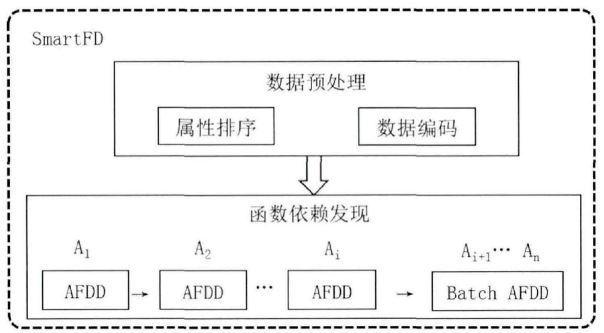

数据预处理环节包含**属性排序**和**数据编码**两个过程：

1. 根据属性的基数、取值频数的方差以及倾斜度对属性进行排序；
2. 对数据进行分布式编码。

FD 发现环节分为两个阶段：

1. 根据己排序的属性列表，依次选取属性 $A_i$ 执行 AFDD，发现所有左部包含 $A_i$ 的 FD；
1. 经过若干轮 AFDD 后，可以发现大部分的 FD ，为了提升计算资源的利用率，采用 Batch AFDD 对剩余的属性同时进行 FD 发现。

其中，AFDD (Attribute-centric Functional Dependency Discovery) 是一种以属性为中心的 FD 发现方法，Batch AFDD 对多个属性同时运行 AFDD。

#### 1.2.1 基于统计信息的数据预处理

在 FD 发现过程中，为保证算法正确性，需要基于每个属性对数据进行重分布。属性相同取值的元组必须发送到同一个计算节点。对于基数过低或者存在数据倾斜的属性，数据重分布后将会导致每个节点计算**负载不均衡**的问题。

一方面，对于取值基数远小于计算节点数的属性，数据进行重分布后，必然存在大量的空闲节点，而且计算负载主要集中在很少的节点。这就造成了计算资源的浪费以及计算负载的不平衡。另一方面，属性取值的分布也会对重分布后计算节点的负载均衡造成很大的影响。根据取值分布不均匀的属性进行重分布，也可能会导致不同计算节点之间数据量不均衡，进而造成计算过程中负载不均衡。

为解决这个问题，利用 FD 发现本身所固有的特点，尽可能的避过或缓解这个问题带来的不利影响。对于候选函数依赖：$X \to R \backslash X$，其中 $X$ 包含属性 $A_{i1}, A_{i,2}, \cdots, A_{ik}$，虽然可以根据 $X$ 中的任意一个属性 $A_ij$ 对数据进行重分布，然后对其进行发现。但是，如果选取基数多且取值分布均衡的属性，算法就能够利用更多的计算资源，因此需要针对该现象进行算法设计，尽可能的保证每个候选 FD 利用其左部中均衡的属性对其进行发现。

在 `1.1.1` 的正确性问题的解决思路中，步骤 3 所述发现所有的左部包含重分布时选取的属性的、未被处理的非平凡 FD，蕴含着一种内在的次序，即一个 FD 会在优先被选择的属性上进行发现。因此，**可以使用一种综合考虑基数、方差和倾斜度的属性排序算法，该算法通过对属性排序，来优先选取能够使得负载均衡的属性进行 FD 发现**。

为了保证正确性，需要依次选取属性进行数据重分布，这就不可避免地带来了网络开销。FD 发现过程中，需要进行大量的比较操作，因此，直接基于输入数据（字符串格式）进行发现，会造成大量的字符串比较，严重拖慢了算法的运行时间。针对上述两个问题，可以使用对数据进行编码的方案。该方案**将字符串转换为全局唯一的整型表示**，一方面压缩了数据量，减少了网络通信；另一方面将字符串的比较操作，转换成了整型的比较操作，节约了计算时间。

#### 1.2.2 分布式 FD 发现

AFDD 是分布式 FD 发现的核心过程，流程图（图源见*参考文献 1*）如下：

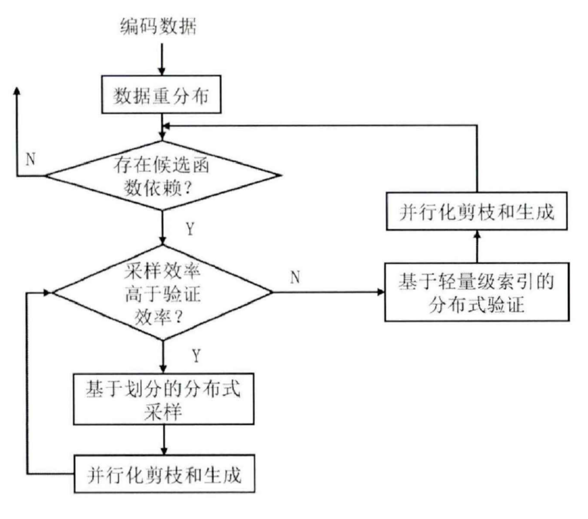

AFDD 包括**数据重分布**、**基于划分的分布式采样**、**并行化剪枝——生成**、**基于轻量级索引的分布式验证**和**采样——验证切换**五个组件。

##### 1.2.2.1 数据重分布

数据重分布过程有两大任务：

1. 为保证 FD 发现算法的正确性，必须把所选属性斗上取值相同的元组发送到同一个节点；
2. 为了提升 FD 发现过程中的负载均衡，需要在重分布数据后，尽可能地保证节点间的数据量相对均衡。

在此算法算法，利用**哈希映射**，将取值相同的元组映射到同一个计算节点，来保证 FD 发现正确性。针对负载均衡问题，根据重分布时选取的属性 $A_i$ 的特点，解决方案为：如果 $A_i$ 的基数大且取值分布均匀，则对元组中 $A_i$ 的取值进行哈希，并将其映射到对应的节点；否则对元组在待验证的函数依赖 $fd$ 的左部包含的所有属性取值进行哈希，然后将其发送到对应的节点，这种方案只能利用本次重分布数据对该 $fd$ 进行验证。

##### 1.2.2.2 基于划分的分布式采样

借鉴 HyFD 算法的思路，在 FD 发现阶段**采用采样——验证的求解方案**。算法利用采样，快速地发现并删除不成立的 FD；利用验证，高效地处理成功通过了采样阶段的 FD。

对于单机算法来说，所有的数据均存储在同一个节点上，可以实现对全局数据的采样，并根据采样结果计算得到全局的采样效率，然后根据采样效率来决定是否继续进行采样。分布式算法则不同，由于涉及到节点间的同步问题，在汇总采样结果之前，无法得到全局的采样效率，这就导致了每个节点利用部分数据进行了多轮采样，汇总结果后发现存在大量重复数据，进而导致每个节点的局部采样效率高，而全局采样效率却很低。因此，单机采样算法不适用于分布式场景，必须针对上述问题，进行分布式采样方法的设计。

根据以上分析，可以使用**基于划分的分布式采样方法**，该算法在单个节点上采用了小批量的采样策略，即每次只进行一轮采样，然后汇总数据，这样就能够更准确的度量采样的效率。而且，虽然这种方案在减少了单个节点上每次采样所获取到的采样数据，但由于采用了分布式的采样，全局的采样数据并不会受到太大的影响，而且结合后面的采样－验证自适应切换策略，这种方案能够更好的提升算法的整体效率。

##### 1.2.2.3 基于轻童级索引的分布式验证

验证由于计算复杂度高以及计算过程中需要生成大量中间数据的特性，导致其计算非常耗时，且内存占用很大。为此，使用**基于轻量级索引的分布式验证方法**。

首先，该算法为每个元组建立轻量级索引。然后，利用轻量级索引进行比较验证。轻量级索引用较小的代价避免左部和右部的生成，进而减少了验证环节计算和内存的开销。

##### 1.2.2.4 并行化剪枝——生成

分布式采样和验证结束后，需要根据其结果对候选集进行剪枝并生成新的候选 FD，因此需要设计剪枝－生成的方法。通过分析，可以发现剪枝——生成方法面临着两大挑战：

1. 与单机验证不同，分布式环境下采用依次选取属性进行 FD 发现的策略，导致剪枝——生成方法的正确性难以保证；
2. 分布式采样结果庞大，剪枝过程需要进行深度优先遍历，查找不成立的候选 FD，并删除，生成过程同样需要进行这种遍历，导致剪枝——生成方法面临着巨大的计算压力。

针对以上两大挑战，可以使用**并行化剪枝——生成方法**。

##### 1.2.2.5 采样——验证自适应切换策略

假设数据集中任意两个元组 $t_i$ 和 $t_j$ 在相同属性上取值相同的概率为 $P_{sim}$，且属性之间相互独立，则对于候选函数依赖 $X \to R \backslash Ｘ$，其中 $X$ 包含 $k$ 个属性，$t_i$ 和 $t_j$ 在左部 $X$ 上取值相同的概率为 $P_{sim}^k$。可以看出，左部相同的概率随着左部属性个数的增加呈指数级别下降趋势，因此找到左部相同数据的难度也就逐渐增加。

随着采样的进行，不成立的候选 FD 被排除，并生成下一层左部包含更多属性的候选 FD。因此，FD 发现过程的特点，决定了采样的难度是逐渐增加的。此外，低层不成立的 FD 被剪枝，导致了候选 FD 越来越接近最终成立的 FD，进而无法通过采样来排除。如果此时继续采样，会严重影响算法的性能，因此需要切换到验证环节。

**何时进行采样和验证的切换是算法设计中的一大难点**。切换太早，无法利用采样对不成立的候选 FD 进行快速的排除；切换太晚，会导致长时间进行低效的采样。针对该问题，使用了**采样——验证自适应切换策略**，它首先对采样和验证效率基于时间进行度量，然后根据度量结果对采样和验证进行自动切换。

## 2. 详细算法设计与实现

本节详细说明**基于统计信息的数据预处理**和**分布式 FD 发现**的实现。

### 2.1 基于统计信息的数据预处理

首先，每个计算节点并行地根据分片数据计算得到特定的统计信息并汇总至主控节点。然后，主控节点根据汇总得到的全局统计信息对属性进行**排序**。完成属性排序后主控节点广播全局统计信息和己排序属性到每个计算节点。最后，每个计算节点根据接收到的广播信息对本节点的数据进行**编码**。

整体架构图如下（图源见*参考文献 1*）：

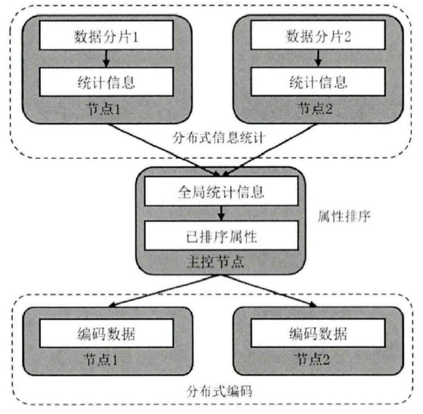

#### 2.1.1 基于基数、方差和倾斜度的属性排序算法

按照 `1.2.1` 的分析，优先选择基数大和取值分布均匀的属性进行 FD 发现，可以提高算法性能。**属性的基数，可以通过分布式信息统计的结果直接计算得到。而属性的取值分布均匀程度，可以利用属性取值的频数的方差来进行度量。**

**问题**：如果数据重分布时选取的属性方差极人或者基数极小，将导致数据重分布后个别节点数据量极大，进而导致计算时间长甚至内存溢出的问题。因此需要对这种异常的属性进行特殊处理。

**解决思路**：用**属性倾斜度**的概念来刻画这种属性。属性倾斜度的计算方法为：首先获取属性出现次数最多取值 $v$，然后利用 $v$ 出现的次数除以数据集中元组个数 $n$ 得到该属性的倾斜度。排序过程中，首先根据倾斜度大小将属性分为倾斜属性和非倾斜属性，并对倾斜属性根据倾斜度进行排序；然后将非倾斜属性根据基数进行从大到小排序，这样就能保证基数较大者在数据重分布时被优先选取；最后将根据基数排序后的非倾斜属性均分为三组，并对每组中的属性根据方差从小到大排序。通过上述步骤就完成了属性排序。

**核心思想**：将基数大、方差小的属性尽可能地排在前面。由于在排序过程中，一方面会遇到基数大但方差也大的属性，另一方面还会遇到基数小但方差也小的属性，而通过对根据基数排序后的数据进行分组，然后根据方差进行排序的方案，就使得这种属性被排在最前面。

排序的示意图如下：

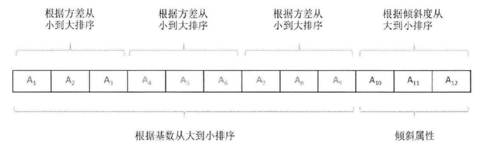

算法的伪代码如下：

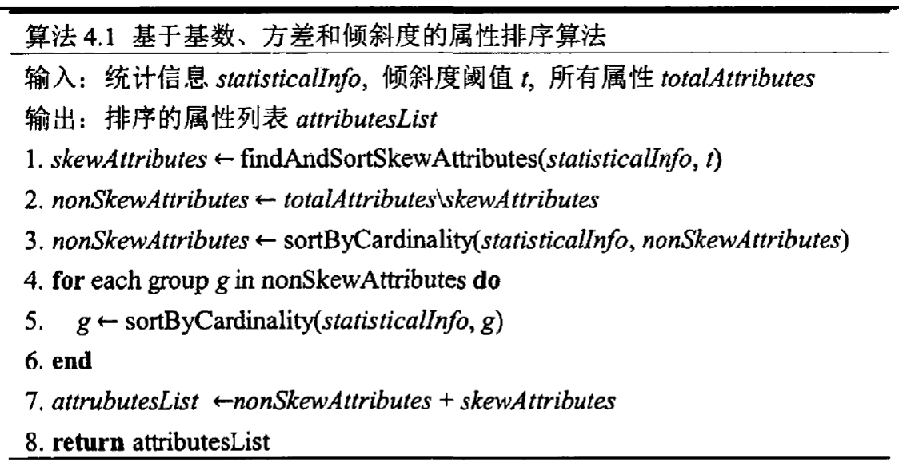

#### 2.1.2 属性编码

**解决思路**：在数据重分布前，广播数据统计信息，然后再并行地在每个计算节点根据统计信息对本地数据进行全局统一编码。优点是只需要对数据进行一次编码；缺点是需要将属性的取值编号信息广播到每个计算节点，带来网络通信的开销。

算法实现的伪代码如下：

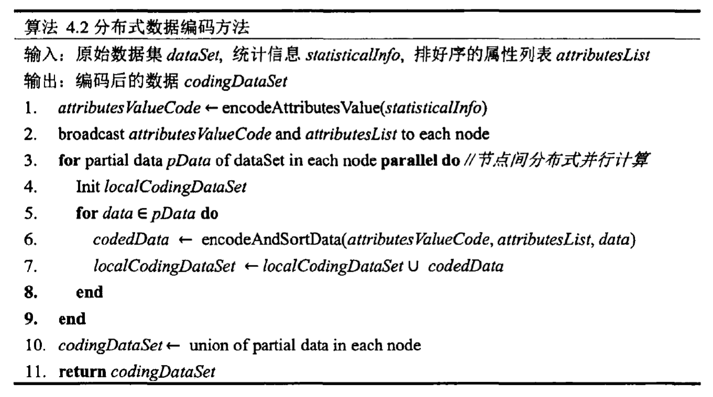

### 2.2 分布式 FD 发现

#### 2.2.1 AFDD

AFDD 的执行流程图如下（图源见*参考文献 1*）：

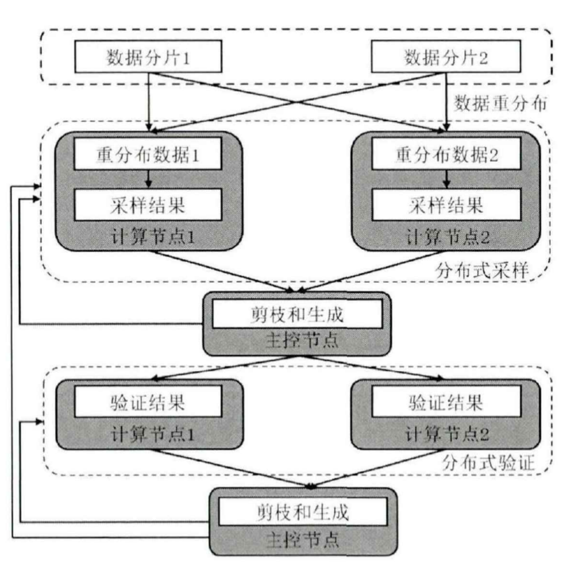

AFDD 的执行流程可以分为 5 步：

1. 根据选取的属性对编码数据进行重分布，将在所选属性上取值相冋的元组根据重分布策略发送到同一个计算节点；
2. 如果存在验证任务，计算节点之间并行地利用本地数据进行采样，采样结束后，发送采样结果到主控节点；如果不存在验证任务，算法结束；
3. 主控节点汇总采样结果，对候选集进行并行化剪——生成，并计算采样效率。如果采样效率高于验证效率，执行步骤 2，否则执行步骤 4；
4. 获取验证任务并广播到每个计算节点，计算节点在收到广播任务后，并行地利用本地数据对其进行验证，并发送验证结果到主控节点；
5. 主控节点汇总验证结果，对候选集进行并行化剪枝——生成，并计算验证效率。如果验证效率高于采样效率，执行步骤 4，否则跳转到步骤 2。

##### 2.2.1.1 数据重分布

假设重分布选取的属性为 $A_i$（倾斜属性），重分布方法的步骤如下：

1. 自底向上逐层获取包含属性 $A_i$ 的的候选函数依赖 $fds$；
2. 对 $fds$ 中的每个候选函数依赖 $fd(lhs \to rhs)$，根据此中的所有属性对数据进行重分布。

算法伪代码如下：

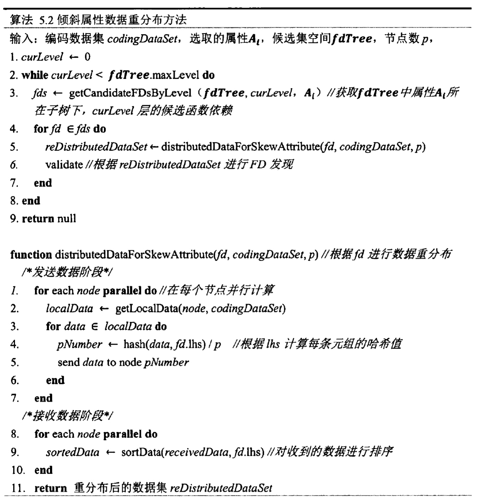

##### 2.2.1.2 基于划分的分布式采样

执行流程：

1. 对于每个计算节点，并行执行步骤 2 到 9；
2. 如果 `attributePartition` 为空，则说明是第一次进行采样，需要计算采样所需的数据结构，因此执行步骤 3 到 4；否则执行步骤 5；
3. 获取本节点的数据 `localData`，并根据 `localData` 并行地计算每个属性的划分得到所有属性的划分 `attributePartitions`；
4. 并行地对 `attributePartitions` 中每个属性的划分 `attributePartition` 进行排序。为了在采样阶段高效地发现冲突，对属性 $A_i$ 的划分 `attributePartition` 进行排序。排序的方法为，对 `attributePartition` 中的每个等价类中的元组，以 $A_{i-1}$ 的取值作为依据进行排序，如果 $A_{i-1}$ 取值相同，则利用 $A_{i+1}$ 作为依据进行排序。排序结束后初始化 `invalidFDs` 用来记录采样历史数据；
5. 初始化 `newInvalidFDs` 用来记录每轮采样所得到的新数据；
6. 并行地对 `attributePartitions` 中每个属性的划分 `attributePartition` 执行步骤 7 到 8；
7. 对 `attributePartition` 中的每个等价类 `cluster` 执行步骤 8；
8. 利用滑窗，对 `cluster` 中的数据进行比较，得到结果 `invalidFD`，如果 `invalidFD` 没有在历史采样结果 `invalidFDs` 中出现，将其添加到 `invalidFDs` 和 `newInvalidFDs` 中；
9. 发送 `newInvalidFDs` 到主控节点；
10. 主控节点收集计算节点的采样结果，并去除其中的重复数据，得到最终的采样结果并返回。

算法伪代码如下：

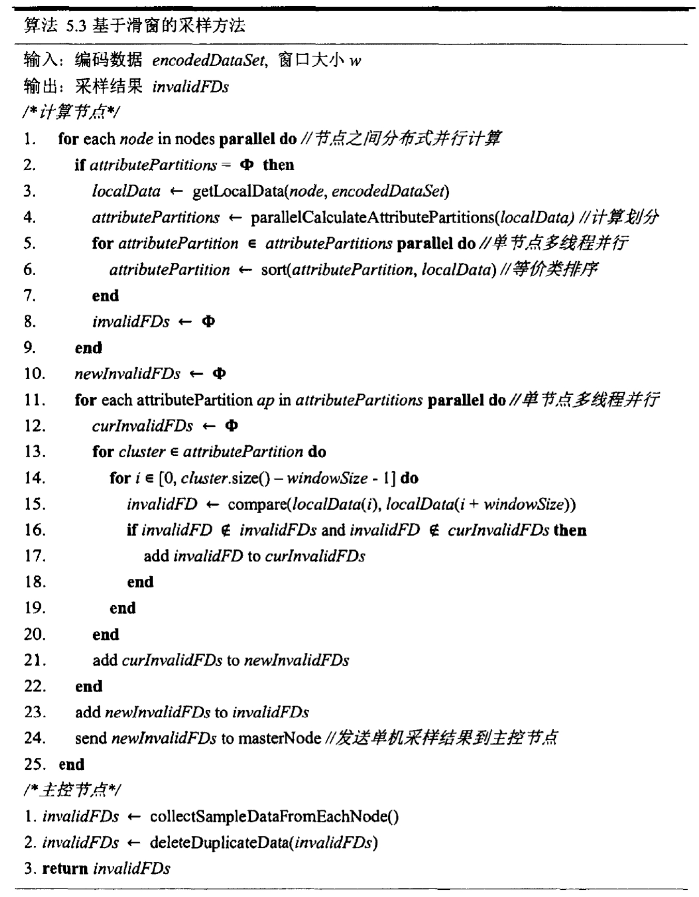

##### 2.2.1.3 并行化剪枝——生成

**将候选集空间组织成前缀树 `FD-tree` 的形式。**

剪枝过程中，首先在 `FD-tree` 中查找不成立的候选 FD，并删除。然后生成新的候选 FD，并添加到 `FD-tree` 中。

**解决计算压力大**：并行地对每棵子树进行剪枝——生成。具体的，对于不成立的函数依赖 $nfd$，在每个子树下并行的利用其进行剪枝——生成，剪枝过程中，只修剪在当前属性所对应子树下根据该 $nfd$ 查找（查找该 $nfd$ 及其一般化）到的不成立的 FD，并根据上文所述的生成规则对修剪的 FD 进行生成。

算法伪代码如下：

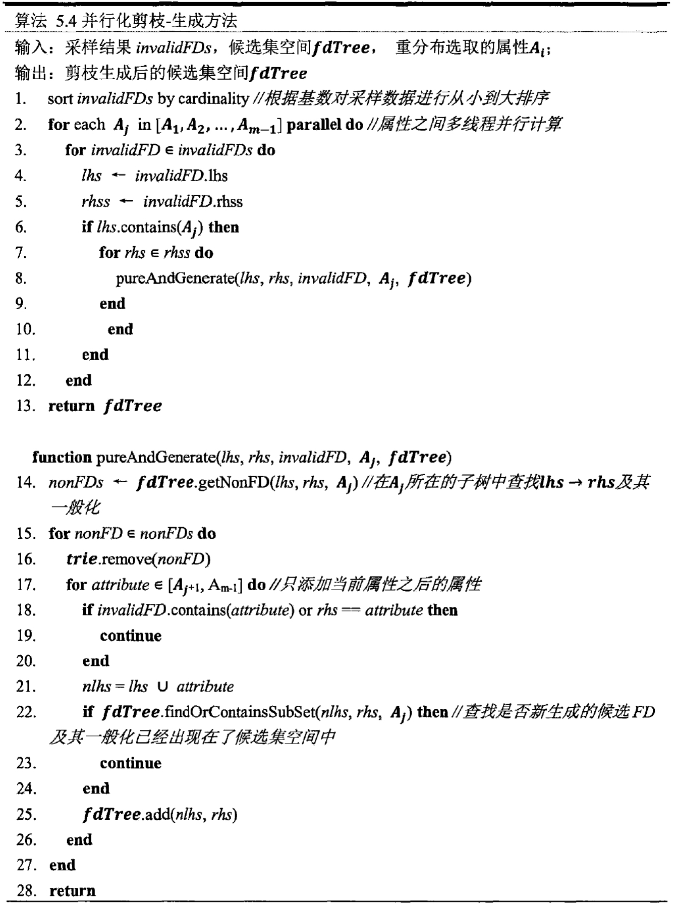

##### 2.2.1.4 基于轻量级索引的分布式验证

可以分为**候选集获取**和**候选集验证**。候选 FD 获取为从 `FD-tree` 中获取重分布时选取的属性所在子树下的候选 FD；候选 FD 验证为在每个节点对获取的候选函数集进行分布式验证。

###### 2.2.1.4.1 候选集获取

执行流程：

1. 初始化候选集 `candidateFDs` 为空；
2. 当 `candidateFDs` 为空，并且当前搜索层 `taskLevel` 小于树的深度 `FD-tree.depthh` 时，执行步骤 3 直到 `candidateFDs` 非空或 `taskLevel` 大于树的深度；
3. 根据 `taskLevel` 和重分布选取的属性 $A_i$ 获取 $A_i$ 所在子树下 `taskLevel` 层的候选 FD，并将 `taskLevel` 加 $1$；
4. 返回 `candidateFDs`。

伪代码为：

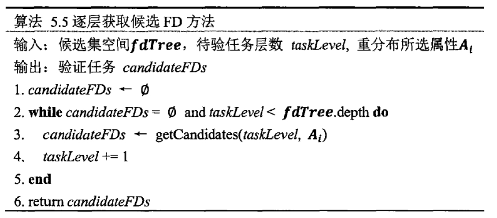

###### 2.2.1.4.2 候选集验证

执行流程：

1. 首先，主控节点广播验证任务到从节点。然后，并行地在每个从节点执行步骤 2；
2. 首先，初始化本节点的验证结果 `invalidFDs` 为空，然后，并行地验证候选集 `candidateFDs` 中的每个候选函数依赖 `candidateFD`。单个 `candidateFD` 的验证过程为步骤 3 到步骤 4；
3. 初始化当前待验 FD 的验证结果 `curInvalidFDs` 为空，并获取 `candidateFD` 中的左部索引 `lhsIndex` 和右部索引 `rhsIndex`；
4. 对重分布时选取属性 $A_i$ 的每个等价类中的数据执行步骤 5；
5. 初始化 `clusterSet` 为空，用来存储轻量级索引。对于等价类 `cluster` 中的所有数据，生成轻量级索引，并判断 `clusterSet` 是否包含相同的元素。如果包含相同元素，则取出来并根据这两个轻量级索引，对候选 FD 进行验证；如果不包含相同元组，则将生成的轻量级索引放入 `clusterSet` 中；
6. 当等价类 `cluster` 中所有数据被处理完毕后，将该 FD 的验证结果 `cusInvalidFDs` 加入到本节点的验证结果 `invalidFDs` 中；
7. 当所有的候选 FD 验证结束后，发送该节点上的验证结果到主控节点；
8. 主控节点对收到的验证结果进行汇总，并去除重复，然后返回所有的验证结果 `totalInvalidFDs`。

伪代码：

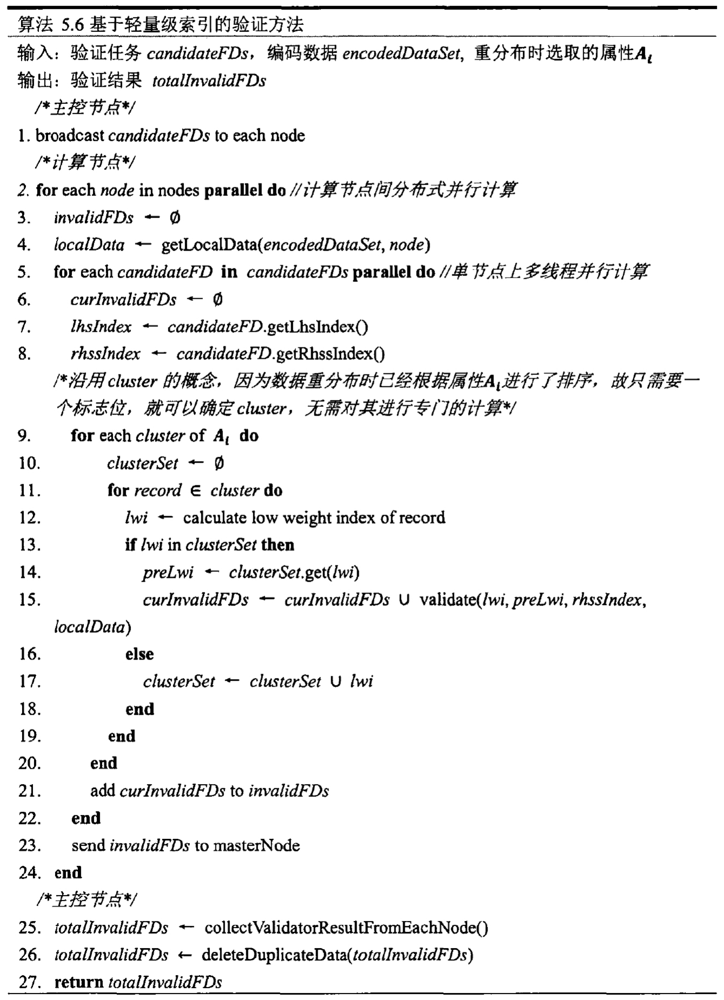

##### 2.2.1.5 采样——验证自适应切换策略

执行流程：

1. 初始化验证效率 `validateEfficiency` 和 `sampleEfficiency` 为 $0$。当属性 $A_i$ 对应的子树下存在候选 FD 时，执行步骤 2，直到属性 $A_i$ 对应的子树下不存在候选 FD；
2. 进行分布式探测，获取探测结果 `detectionResult`。如果 `detectionResult` 中候选集验证失败率大于设定的阈值 $t$，执行步骤 3，否则执行步骤5；
3. 如果是第一次采样，初始化采样效率 `sampleEfficiency` 为验证估计效率加 １，该操作保证了算法可以进入采样环节；
4. 当采样效率大于验证效率时，进行分布式采样，计算并更新采样效率，直到采样效率低于验证效率；
5. 进行分布式验证，计算并更新验证效率；
6. 算法返回。

算法伪代码：

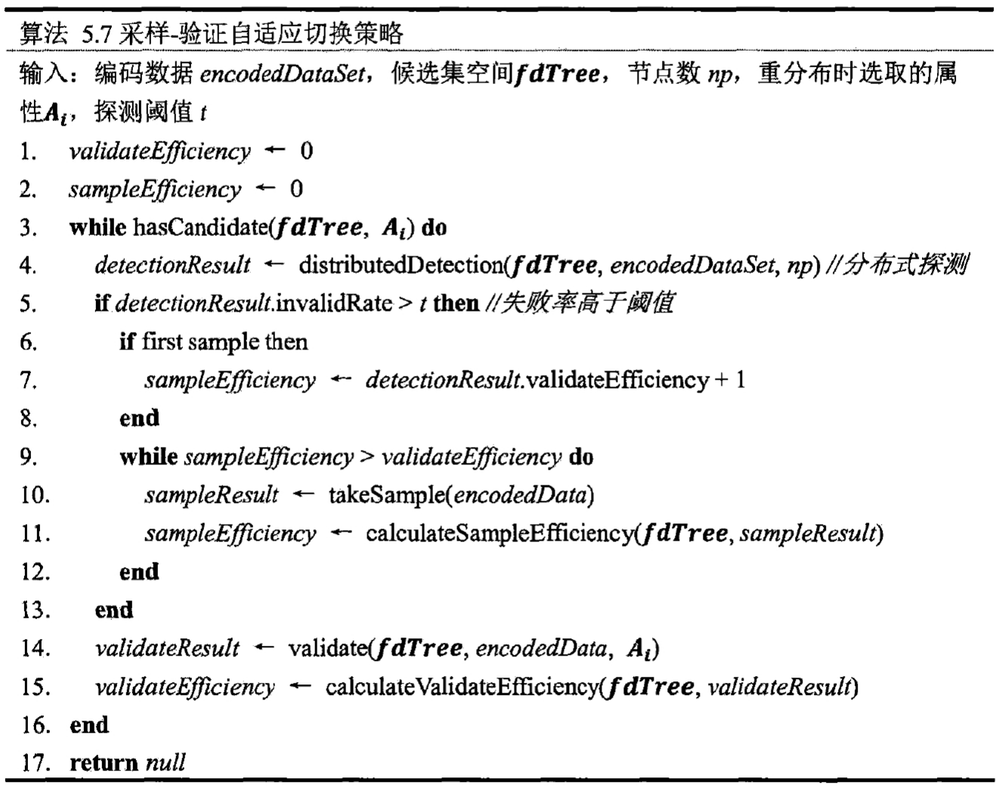

#### 2.2.2 Batch AFDD

为了在 FD 发现末期能够充分利用计算资源，可以使用 Batch FDD 的方案，可以同时对多个属性运行 AFDD。

**面临问题**：属性间并行发现 FD 带来正确性问题。单个属性进行 FD 发现时，对候选集 `FD-tree` 的访问是串行的，不会发生冲突，而多个属性则不同，它们可能会并行地访问 `FD-tree`。

对 `FD-tree` 的访问出现在两个地方：

1. 候选集剪枝－生成阶段，会对 `FD-tree` 进行遍历和修改；
2. 验证任务获取阶段，会对 `FD-tree` 进行遍历。

因此会出现以下两种冲突：

1. 剪枝——生成和任务获取同时对 `FD-tree` 进行操作，或造成修改与遍历的冲突；
2. 同时对 `FD-tree` 进行剪枝——生成会造成修改与遍历的冲突以及修改与修改的冲突。

**解决方法**：**在涉及到 `FD-tree` 操作的地方进行同步，而没有涉及到 `FD-tree` 的操作，例如耗时较长的分布式采样和分布式验证环节，则可以并行执行。**

算法流程：

1. 对每个属性并行执行 AFDD，AFDD 的执行流程为步骤 2；
2. 当候选集 `fdTree` 中存在候选 FD 时执行步骤 3 到步骤 5，直到 `fdTree` 中不存在候选 FD；
3. 根据分布式探测结果或者采样效率和验证效率的关系，确定是否需要进行采样，如果需要则进行采样。采样结束后，申请锁，并根据采样结果对候选集进行剪枝——生成，然后释放锁；
4. 申请锁，并获取验证任务，然后释放锁；
5. 根据验证任务进行分布式验证。验证结束后，申请锁，并根据验证结果对候选集进行剪枝－生成，然后释放锁；
6. 返回经过剪枝——生成处理后的候选集 `fdTree`。

伪代码：

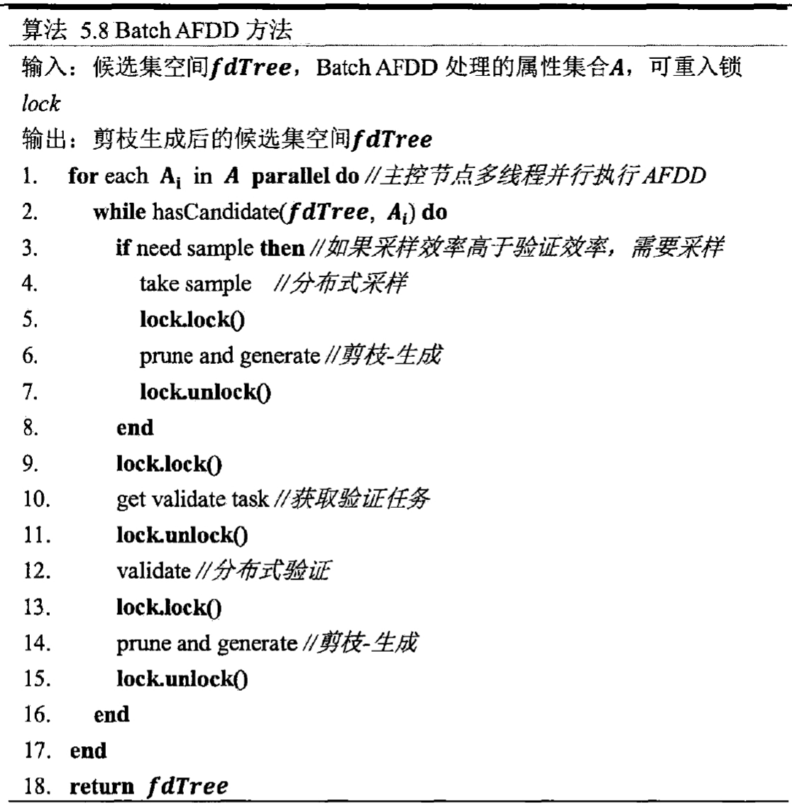

## 3. 实验结果与分析

### 3.1 自建实验环境

|                 |                     |
| :-------------: | :-----------------: |
|     Workers     |          7          |
|      Cores      | 168 (24 per worker) |
| Memory per node |        64GB         |
|  CPU per node   |    AMD EPYC 7713    |

PS：受条件限制，所有的 Worker 开在同一个服务器中，通过 loopback 通信。根据实际观测，CPU 并不构成瓶颈。

### 3.2 性能测试

运行每个 evaluation 数据集的命令见 `4.3` 节。

为了测试程序随着数据集规模（行数与列数）的增长，其性能的变化，除了给出的 4 种大小外，另外裁剪出行数为 `100`、`1k`、`10k`、`100k`、`500k`、`1m`、`2m`、`5m`、`15m`，列数为 `3`、`5`、`7` 的数据集命名为 `bots_<rows>_<cols>.csv`。

程序运行时间如下（单位：s）：

| 行数\列数 |   3    |   5    |   7    |   10   |   15    |
| :-------: | :----: | :----: | :----: | :----: | :-----: |
|    100    | 10.283 | 13.200 | 10.853 | 12.205 | 13.591  |
|    1k     | 9.720  | 10.830 | 10.827 | 10.955 | 12.628  |
|    10k    | 11.051 | 11.628 | 11.326 | 12.362 | 13.665  |
|   100k    | 11.511 | 11.724 | 12.517 | 13.621 | 15.116  |
|   500k    | 12.740 | 13.692 | 13.521 | 13.426 | 15.999  |
|    1m     | 12.285 | 13.806 | 17.078 | 17.620 | 21.793  |
|    2m     | 13.552 | 15.525 | 17.671 | 25.149 | 51.940  |
|    5m     | 17.292 | 22.619 | 29.993 | 36.996 | 60.785  |
|    10m    | 25.002 | 24.753 | 42.547 | 57.633 | 87.828  |
|    15m    | 37.172 | 39.469 | 47.930 | 89.431 | 149.130 |
|    20m    | 36.708 | 44.557 | 51.233 | 99.154 | 176.945 |

从表中可以看出，当列数相同的情况下，当行数小于 500k 时，运行时间主要用于环境初始化等不变开销，当行数大于 500k 时，用时才会有相对于行数的明星增长。

而行数相同的情况下，运行时间相对列数为一个近似的线性关系。

由此可以归纳出本算法的时间复杂度为 $O(mn)$，其中 $n$ 为行数，$m$ 为列数，且 $n$ 需要足够大以掩盖初始化开销。相对于 $O\left( n^2 \left( \cfrac{m}{2} \right)^2 2^m \right)$ 的简单算法有着显著的性能提升。

## 4. 程序代码说明

### 4.1 代码组织结构

`build.sbt` 文件描述项目名称和项目依赖，包括 `spark-2.1.0` 和 `hadoop-2.7.3`。

`project/plugins.sbt` 描述编译命令 `sbt assembly` 的依赖 `sbt-assembly`。

`src` 文件夹包含所有的项目代码。

### 4.2 编译方式

执行

```shell
sbt assembly
```

即可生成目标文件 `target/scala-2.10/FD-assembly-1.0.jar`.

### 4.3 运行方式

<font color="red">运行方式和 PPT 上的标准方式有所区别。</font>

```shell
spark-submit \
    --master <test spark cluster master uri> \
    --class FD.Main \
    --executor.memory 20G \
    --driver.memory 20G \
    --conf spark.driver.maxResultSize=20g \
    --conf spark.memory.fraction=0.3 \
    --conf spark.memory.storageFraction=0.5 \
    --conf spark.shuffle.spill.compress=true \
    target/scala-2.10/FD-assembly-1.0.jar \
    --inputFilePath <输入 csv 文件路径> \
    --tempFilePath <临时工作目录路径> \
    --outputFilePath <输出文件夹路径> \
    --numAttributes <数据集列数> \
    --numPartition <worker 数量>
```

- `inputFilePath`：指向作为输入的 `csv` 文件，如 `dataset/evaluation/bots_20m_15.csv`
- `tempFilePath`：指向临时文件夹，一般设为 `/tmp` 即可
- `outputFilePath`：指向输出文件夹，<font color="red">输出的结果文件为此文件夹下的 `part-00000` 文件</font>
- `numAttributes`：数据集列数，evaluation 数据集中为 `10` 或者 `15`，**请根据数据集调整**
- `numPartition`：PDF 中列出的系统是 `7`，**请根据实际情况调整**

## 5. 参考文献

1. [王千《大规模分布式函数依赖发现算法研究与实现》](https://kns.cnki.net/kcms2/article/abstract?v=3uoqIhG8C475KOm_zrgu4lQARvep2SAkyRJRH-nhEQBuKg4okgcHYrqLpWLnBUgThagECioJljRIQaoRO_6grDwU9aDFCK3q&uniplatform=NZKPT)
